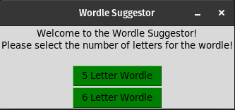
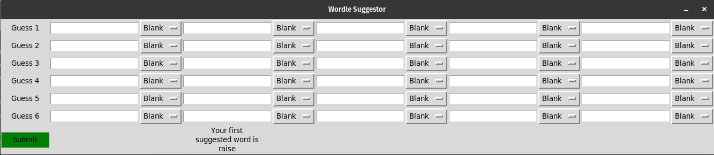
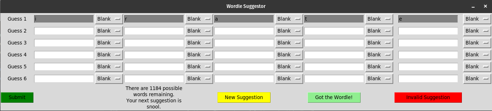

# Wordle Suggestor

If you are like me and get stuck coming up with words to enter when playing Wordle, then this is the program
for you!

## How to Run
To run this text-based Wordle Suggestor, clone the repository and run `python suggestor.py`. 
It runs with both 5-letter words and 6-letter words, so it will ask you if you are playing the traditional 
5-letter Wordle or the alternate 6-letter version. Click the button with the corresponding length to get started.

The program then opens a new window and suggests an initial guess for the first word, but feel free to ignore them if you
already have a strategy in place. The new window looks like this:

For each text entry in the Graphical User Interface (GUI), type exactly one letter. To the right of the entry,
indicate whether that letter was colored Blank, Green, or Yellow. Do this for entry in the row. Then click 'Submit'.
A few new buttons will appear at the bottom of the window.

The program then systematically eliminates words from the dictionary that are impossible based on the
letters and color values that were inputted and provide you a suggested word.

You can get a new suggested word by clicking 'New Suggestion'. Note that it will not always give a new suggested word. 
The program gives words based on the commonality of each letter. 

Occasionally, this dictionary has words that are not in Wordle's official dictionary. If that is the case, click the
'Invalid Suggestion' button. It will then remove that word and suggest a new one. 

Once you have gotten the Wordle, you can click 'Got the Wordle!' or just exit the program. 

## Other Notes

This program does run in "hard mode", meaning you have to use the yellow and green letters from previous 
rounds in your next guess, or it will not provide a suggested word. 

The dictionary in this program is not Wordle's official dictionary, since some of the
words I ended up with as suggestions were not in the dictionary when actually playing Wordle. But to account 
for that, I added an option that lets you remove that word if Wordle won't take it. (If anyone does know of an official
Wordle dictionary, let me know). 

I've tested this program with quite an extensive list of words, so I'm fairly confident this program can handle
pretty much any word combination. If you do find bugs though, let me know. This is just a project done for fun
during my free time. 